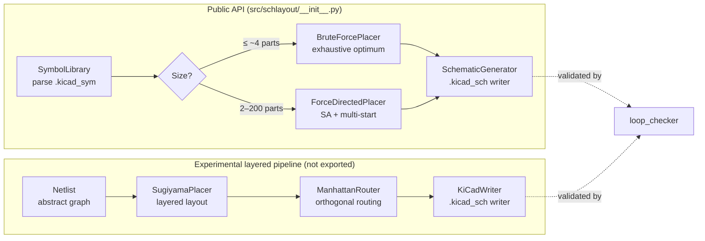

# schlayout


> *“Any sufficiently advanced schematic placer is indistinguishable from a tired graduate student.”*

A schematic auto-placement engine that tries to lay out KiCad components like a human would — and **mostly fails, but fails scientifically**. Built for anyone who has watched KiCad import a netlist and scatter 47 parts across twelve pages like a toddler with LEGOs.

`schlayout` parses real KiCad symbol libraries, searches rotations × grid positions for the minimum-tangle placement, and emits valid `.kicad_sch` files. The honest pitch: ERC passing ≠ a readable schematic, and a cost function does not know that “ground points down” matters infinitely more than “wire length is minimal.” This project is the artefact of finding that out the hard way.

---

## ✨ Features

- **Real KiCad symbol data.** Parses `.kicad_sym` system libraries (`Device`, `power`, …) to extract true pin positions, bounding boxes, and raw S-expression fragments — placements use actual geometry, not toy boxes.
- **Brute-force optimal placement** for small circuits (≤ ~4 components): exhaustive search over rotations × grid cells, guaranteed global optimum on the given grid.
- **Force-directed + simulated-annealing placer** for larger circuits (2–200 components), with multi-start rotation search and overlap/HPWL cost.
- **Loop checker** — the one genuinely useful module: detects wire–wire crossings, wires passing through component bodies, and reports total wire length and a cleanliness verdict.
- **Valid `.kicad_sch` output.** Embeds `lib_symbols`, places components with UUIDs, routes pin-to-pin wires, drops junctions, and adds net labels. Balanced S-expression output that KiCad 7/8 will open.
- **Grid-accurate.** Everything snaps to KiCad’s 2.54 mm (100 mil) grid on an A4 (297 × 210 mm) sheet.
- **A documented cognitive model** (`docs/cognitive_model.md`) — the 11 hierarchical readability principles and three-phase human reading model that explain *why* the placers fail.

---

## 📦 Installation

**Prerequisites**

- **Python 3.10+** (the codebase uses `X | None` union syntax).
- **KiCad 7+** with its symbol libraries installed. `schlayout` reads from the default system paths:
  - macOS: `/Applications/KiCad/KiCad.app/Contents/SharedSupport/symbols`
  - Linux: `/usr/share/kicad/symbols`
  - Either OS: `~/Library/Application Support/kicad`

  Windows is not auto-detected; pass `lib_dirs=[...]` to `SymbolLibrary(...)` if your libraries live elsewhere.

There is no packaging metadata in this repository (no `pyproject.toml` / `setup.py`), so install is source-only:

```bash
git clone https://github.com/bhoot1234567890/schlayout.git
cd schlayout
```

Then either put `src/` on your path manually or run scripts the way the bundled examples do:

```python
import sys
sys.path.insert(0, "src")
```

---

## 🚀 Usage

A complete, runnable example (mirrors `examples/led_optimal.py`): battery → current-limiting resistor → LED.

```python
import sys
sys.path.insert(0, "src")

from schlayout import SymbolLibrary, BruteForcePlacer, NetDef, SchematicGenerator
from schlayout.placer import snap

# 1. Load real symbols from the KiCad system library
lib = SymbolLibrary()
bat = lib.load("Device", "Battery_Cell"); bat.value = "3V"
res = lib.load("Device", "R");             res.value = "220Ω"
led = lib.load("Device", "LED");           led.value = "LED"

# 2. Describe components and nets
components = [("BAT1", bat), ("R1", res), ("D1", led)]
nets = [
    NetDef("VCC",    [("BAT1", "1"), ("R1", "1")]),
    NetDef("LED_IN", [("R1", "2"),   ("D1", "2")]),
    NetDef("RTN",    [("D1", "1"),   ("BAT1", "2")]),
]

# 3. Brute-force the lowest-cost placement on a small grid
placer = BruteForcePlacer(
    components, nets,
    x_range=[snap(x) for x in range(12, 40, 3)],
    y_range=[snap(y) for y in range(30, 60, 4)],
)
placed, score = placer.search()

# 4. Emit a .kicad_sch file
SchematicGenerator(title="LED Circuit").generate(
    placed, nets, "/tmp/led_circuit.kicad_sch", symbol_lib=lib
)
print(f"score={score:.1f}  written /tmp/led_circuit.kicad_sch")
```

Expected output (proportions vary with your KiCad symbol versions):

```text
BAT 7.62×7.62mm  R 5.08×5.08mm  LED 5.08×5.08mm
score=43.5  written /tmp/led_circuit.kicad_sch
```

Open `/tmp/led_circuit.kicad_sch` in KiCad. For larger circuits, swap `BruteForcePlacer` for `ForceDirectedPlacer` (see Configuration) — that is what `tests/test_circuits.py` uses to lay out op-amp buffers, 555 timers, bridge rectifiers, and H-bridges.

---

## ⚙️ Configuration

### `BruteForcePlacer`

| Parameter | Default | Description |
|-----------|---------|-------------|
| `x_range`, `y_range` | auto (grid-fitted to the page) | Candidate X/Y positions to search, in mm. Smaller = faster. |
| `rotations` | `[0, 90, 180, 270]` | Rotations tried per component. |
| `bend_penalty` | `10.0` | Cost added per non-axial wire segment. |
| `page_width` / `page_height` | `297.0` / `210.0` | A4 sheet in mm. |
| `page_margin` | `5.0` | Keep components this far from the page edge. |

Cost = sum of Manhattan wire lengths + bend penalties + a 30-point collision penalty when distinct nets share a Y. Search space is `|xs|ⁿ × |ys|ⁿ × |rots|ⁿ`, so keep the grid small for n > 4.

### `ForceDirectedPlacer`

| Parameter | Default | Description |
|-----------|---------|-------------|
| `T_initial` / `T_min` / `alpha` | `200.0` / `0.05` / `0.93` | Simulated-annealing temperature schedule. |
| `moves_per_temp` | `40` | Moves evaluated at each temperature step. |
| `max_steps` | `150` | Annealing iterations. |
| `attraction` / `repulsion` | `1.0` / `80.0` | Net attraction vs. overlap repulsion forces. |
| `centering` | `0.02` | Weak pull toward the page centre (stops “insects fleeing to the edges”). |
| `rotation_restarts` | `True` | For n ≤ 4, tries every rotation combination. |
| `position_restarts` | `3` | Independent position initialisations; best score wins. |
| `allowed_rotations` | `[0, 90, 180, 270]` | Rotations considered. |
| `random_seed` | `42` | Set for reproducibility. |

---

## 🧱 Architecture

The package grew through eight failed placement strategies (documented in `docs/cognitive_model.md`). It now contains **two parallel pipelines**:



**Public stack** (exported from `schlayout`): real symbol data in, `.kicad_sch` out. This is the path used by `examples/led_optimal.py` and `tests/test_circuits.py`.

**Experimental layered stack** (`netlist.py` → `layout.py` → `routing.py` → `kicad_writer.py`): a Sugiyama/ELK-inspired layered placer built on an abstract `Netlist` graph. It is importable from the submodules directly but is **not re-exported** by `__init__.py`, so treat it as a work in progress.

### Module map

| Module | Role |
|--------|------|
| `symbols.py` | KiCad `.kicad_sym` parser → `SymbolLibrary`, `SymbolData`, `SymbolPin`. |
| `placer.py` | Exhaustive `BruteForcePlacer` over rotations × grid. |
| `force_placer.py` | `ForceDirectedPlacer`: force-directed + SA + multi-start. |
| `cognitive_placer.py` | Placer built on the 11 readability principles (voltage gradient, series-chain detection). |
| `cycle_placer.py` | Graph-theory cycle-breaker → tree layout. |
| `loop_checker.py` | Wire-crossing / wire-through-component detection; wire-length metrics. |
| `generator.py` | `.kicad_sch` writer for the public placer stack. |
| `netlist.py` | Abstract circuit graph (`Netlist`, `Component`, `Pin`, `SymbolDef`). |
| `layout.py` | `SugiyamaPlacer` — layered placement for the netlist stack. |
| `routing.py` | `ManhattanRouter` — orthogonal spanning-tree routing with junctions. |
| `kicad_writer.py` | `.kicad_sch` writer for the netlist stack. |

---

## 🔍 The loop checker

Feed it a placement’s wires and component boxes and it tells you whether the layout tangles:

```python
from schlayout.loop_checker import check_loop

result = check_loop(wires, component_bboxes, pin_positions)
print(result["is_clean"])          # True if no crossings, no penetrations
print(result["total_length"])      # total wire length (mm)
print(result["crossings"])         # [(wire_idx, wire_idx), ...]
print(result["component_crossings"])  # [(wire_idx, comp_idx), ...]
```

Also exports `wire_length`, `hpwl` (half-perimeter wire length), `segments_intersect`, and `minimal_wire_length_possible` for cost-function experiments.

---

## 📚 Test circuit catalog

`docs/circuits.md` defines ten canonical circuits drawn entirely from KiCad’s `Device` and `power` libraries, ranging from a 3-part LED loop up to a 7-component buck converter (R-2R ladder, LC tank, Wheatstone bridge, pi filter, …). `tests/test_circuits.py` exercises a second set of ten (pull-up, BJT switch, op-amp buffer, 555 astable, full-bridge rectifier, 7805 regulator, transistor H-bridge) through `ForceDirectedPlacer`.

---

## 🤝 Contributing

There is no `CONTRIBUTING.md`. If you understand why `self.y - py` is correct in `PlacedComponent.pin_world` (KiCad’s Y-axis points up, screen Y points down), you are already qualified. Read `docs/cognitive_model.md` first — it explains the hierarchical cost model that any new placer should respect.

---

## 📄 License

**No `LICENSE` file is present in this repository.** Without one, default copyright applies and no usage, modification, or distribution rights are granted. Add a `LICENSE` file (e.g. MIT, Apache-2.0) to declare terms before relying on this code.

---

*“The difference between a good schematic and a bad one is about 12 pixels and three hours of your life.”*
